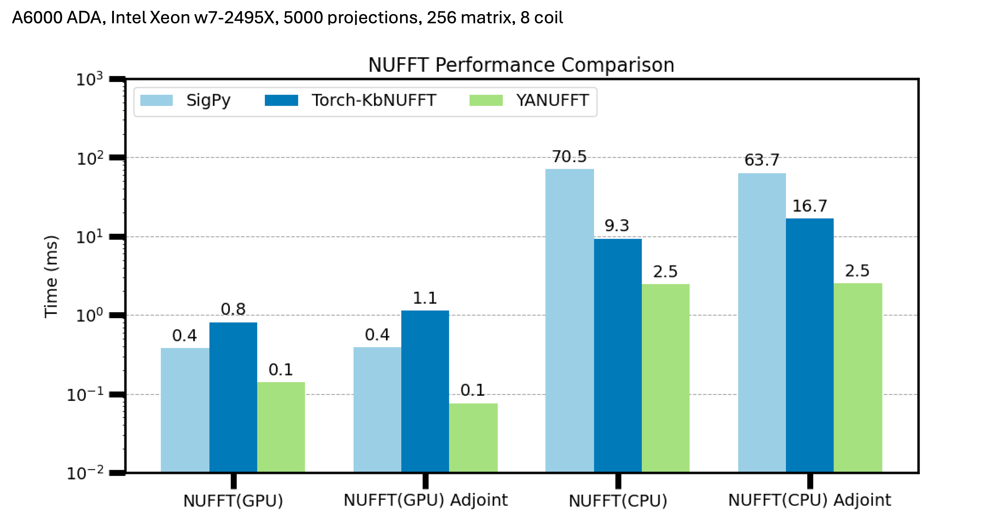

# Yet Another Non-uniform Fourier Transform (YANUFFT)

## Goals 
There are some great NUFFT packages for MRI image reconstruction, namely:

* [torchkbnufft](https://github.com/mmuckley/torchkbnufft) (Pythonic PyTorch NUFFT)
* [TF KB-NUFFT](https://github.com/zaccharieramzi/tfkbnufft) (KB-NUFFT for TensorFlow)
* [SigPy](https://github.com/mikgroup/sigpy) (for Numpy arrays, Numba (for CPU) and CuPy (for GPU) backends)
* [FINUFFT](https://github.com/flatironinstitute/finufft) (for MATLAB, Python, Julia, C, etc., very efficient)
* [NFFT](https://github.com/NFFT/nfft) (for Julia)
* [PyNUFFT](https://github.com/jyhmiinlin/pynufft) (for Numpy, also has PyCUDA/PyOpenCL backends)

While these are great and often useful packages, they make some tradeoff for performance (especially on CPU) and/or require complex libraries (e.g. cupy). The goals of `yanufft` were to:

1. Full support and integration into `PyTorch` including `torch.autograd` for auto differentiating through neural networks. Including the coordinates!  
1. Allow high performance on GPU and CPU. This is achieved using OpenMP accelerated C++ code and directly written Cuda kernels for gridding/interpolation options. This does mean the kernels need to be compiled during install.
1. Minimize memory usage for large 3D problems.
1. Support sensitivity maps for SENSE operators.  

## Usage

## Benchmarking

Some simple benchmarking from [benchmark.py](benchmark.py) from early code versions (no toplitz, no coil batching). The gains are particularly evident for CPU versions but CUDA gains are also evident (~4-8x). 

